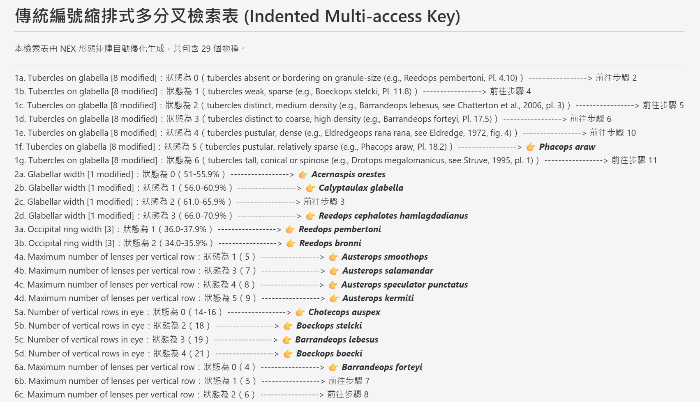
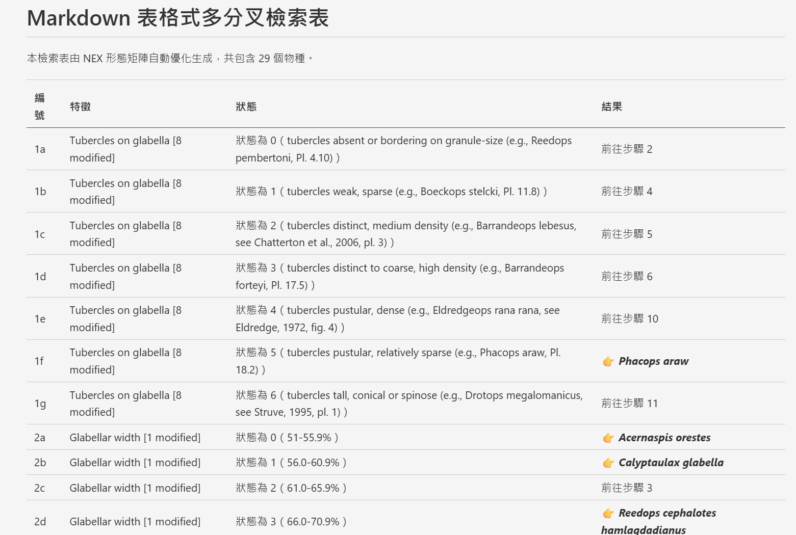

# nex2dichotomous

將 NEXUS（.nex）形態特徵矩陣，自動轉換為「編號縮排式多分叉檢索表」（Indented multi-access key）Markdown 檔案的小工具。

程式會讀取 .nex 檔中的物種（Taxa）與形態特徵矩陣，**先移除任一物種含有缺失符號（missing/gap，如 `?`、`-`）的特徵欄位**，再以 entropy 準則自動找出最具區辨力的特徵組合。每個狀態會建立獨立分支，最後輸出成傳統分類學上常見的**編號縮排格式（如 `1a.`、`1b.`、`1c.`、`2a.`…）**。

測試用 NEXUS 檔案: `2009-early-and-middle-devonian-phacopidae-of-south-moroccan.nex` 取自於 [MorphoBank](https://www.morphobank.org/project/2702/matrices) 是摩洛哥南部泥盆紀鏡眼蟲支序分類論文 [Palaeontographica Canadiana No. 28: Early and Middle Devonian Phacopidae (Trilobita) of southern Morocco is a 2009 scientific monograph written by Ryan C. McKellar and Brian D. E. Chatterton.](https://www.researchgate.net/publication/232196035_Early_and_Middle_Devonian_Phacopidae_Trilobita_of_southern_Morocco) 當時以支序分類軟體 PAUP 分析時所使用之 NEXUS 檔案。

## 功能特色

- 支援標準 NEXUS 檔案（以 [Biopython](https://biopython.org/) 解析）。
- 若檔案使用 Biopython 無法解析的 `CHARLABELS` 語法（例如部分 MorphoBank 匯出格式），會自動改用內建的簡易格式解析器重試，盡量取回物種名稱、特徵名稱與矩陣資料。
- 若檔案包含 `STATELABELS`，會解析各字元的狀態說明，並在檢索表的狀態編號後顯示其實際意義。
- 處理前會自動偵測並移除含有缺失值的特徵欄位，避免分類樹把「缺失」誤判為一種真實狀態。
- 若移除缺失特徵後仍有物種彼此完全相同、無法區分，檢索表會將這些物種並列顯示（如 `物種A / 物種B`），而不會遺漏。
- 可選擇輸出為傳統編號縮排格式或 Markdown 表格；兩種格式皆依步驟編號排序（如 `1a`、`1b`、`2a`），最終物種名稱皆以粗斜體顯示。

## 系統需求

- Python 3.9 以上（開發與測試環境為 Python 3.12）
- 套件：
  - `biopython`
  - `pandas`

## 安裝方式

1. 下載或 clone 本專案到本機。
2. （建議）建立並啟用虛擬環境：

   ```powershell
   python -m venv .venv
   .venv\Scripts\Activate.ps1
   ```

3. 安裝相依套件：

   ```powershell
   pip install -r requirements.txt
   ```

   或手動安裝：

   ```powershell
   pip install biopython pandas
   ```

## 使用方式

1. 開啟 [nex2polytomous.py](./nex2polytomous.py)，修改檔案開頭的設定：

   ```python
   NEXUS_FILE_PATH = "your_data.nex"              # 👈 換成你實際的 .nex 檔案路徑
   OUTPUT_MD_PATH = "generated/polytomous_key.md"  # 👈 輸出的 Markdown 檔案路徑（可自訂）
   ```

2. 執行程式。未指定輸出格式時，預設產生 Markdown 表格：

   ```powershell
   python nex2polytomous.py
   ```

   若要產生傳統編號縮排格式，請使用 `--output-format indented`（或簡寫 `-f indented`）：

   ```powershell
   python nex2polytomous.py --output-format indented
   ```

   亦可明確指定表格格式：

   ```powershell
   python nex2polytomous.py --output-format table
   ```

3. 執行過程中會顯示處理訊息，例如：

   ```text
   正在讀取並解析 NEX 檔案: your_data.nex...
   🧹 已移除 N 個含有缺失符號 (missing symbols) 的特徵欄位，共保留 M 個。
   ✅ 成功載入！共偵測到 X 個物種，M 個形態特徵（已排除含缺失值的特徵）。
   🎉 轉換完成！檢索表已儲存至：generated/polytomous_key.md
   ```

4. 完成後，即可在指定路徑找到輸出的 Markdown 檢索表。`--output-format indented` 的格式範例如下：

   ```markdown
   1a. 特徵名稱：狀態為 0（狀態 0 的實際意義） -----------------> 前往步驟 2
   1b. 特徵名稱：狀態為 1（狀態 1 的實際意義） -----------------> 前往步驟 5
   1c. 特徵名稱：狀態為 2（狀態 2 的實際意義） -----------------> 👉 ***物種 C***
      2a. 另一特徵：狀態為 0（狀態 0 的實際意義） -----------------> 👉 ***物種 A***
      2b. 另一特徵：狀態為 1（狀態 1 的實際意義） -----------------> 👉 ***物種 B***
   ```

   

   預設的 `--output-format table` 則會將編號、特徵、狀態與結果分欄：

   ```markdown
   | 編號 | 特徵 | 狀態 | 結果 |
   |---|---|---|---|
   | 1a | Tubercles on glabella [8 modified] | 狀態為 0（tubercles absent or bordering on granule-size） | 前往步驟 2 |
   | 1b | Tubercles on glabella [8 modified] | 狀態為 1（large tubercles present） | 👉 ***物種 A*** |
   ```

   

## 常見問題

- **為什麼有些特徵在輸出中不見了？**
  因為該特徵在至少一個物種上為缺失值（`?`）或間隙（`-`），程式會在建立分類樹前先整欄移除，以避免用不完整或不確定的資料做為判斷依據。

- **為什麼有兩個（或多個）物種名稱同時出現在同一個判定結果？**
  代表在移除缺失特徵後，這些物種在剩餘的所有特徵上完全相同，現有資料已無法再進一步區分它們，因此會並列顯示，而不是隨機選一個。

- **讀取檔案時出現「Biopython 解析失敗」訊息怎麼辦？**
  這通常是因為 `.nex` 檔案使用了 Biopython 不支援的 `CHARLABELS` 格式（例如部分 MorphoBank 匯出檔）。此時程式會自動改用內建的簡易格式解析器重試，通常仍可正確取得物種與矩陣資料；若特徵名稱無法解析，將以 `Char_1`、`Char_2`…等預設名稱代替。

## 授權

本專案原始碼採用 [MIT License](./LICENSE) 授權，可自由使用、修改與散布。
惟本專案所附範例 `.nex` 資料檔案僅供測試展示之用，請依你實際所使用的 NEXUS 資料檔案本身之授權條款使用。
